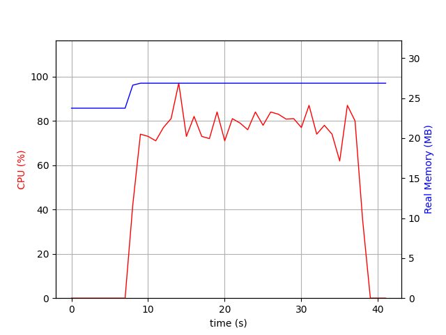

## Performance Benchmark 

### wrk

```bash
wrk -t4 -c128 -d30s http://127.0.0.1:8888/
Running 30s test @ http://127.0.0.1:8888/
  4 threads and 128 connections
  Thread Stats   Avg      Stdev     Max   +/- Stdev
    Latency    21.80ms   28.45ms 482.37ms   95.65%
    Req/Sec     1.83k   255.22     2.41k    65.33%
  218244 requests in 30.03s, 26.64MB read
Requests/sec:   7268.42
Transfer/sec:      0.89MB
```

### k6

```bash
  █ TOTAL RESULTS 

    checks_total.......: 209673  6980.331571/s
    checks_succeeded...: 100.00% 209673 out of 209673
    checks_failed......: 0.00%   0 out of 209673

    ✓ status 200

    HTTP
    http_req_duration..............: avg=28.56ms min=268.83µs med=22.4ms  max=889.05ms p(90)=39.16ms p(95)=44.68ms
      { expected_response:true }...: avg=28.56ms min=268.83µs med=22.4ms  max=889.05ms p(90)=39.16ms p(95)=44.68ms
    http_req_failed................: 0.00%  0 out of 209673
    http_reqs......................: 209673 6980.331571/s

    EXECUTION
    iteration_duration.............: avg=28.61ms min=290.55µs med=22.44ms max=889.09ms p(90)=39.21ms p(95)=44.73ms
    iterations.....................: 209673 6980.331571/s
    vus............................: 200    min=200         max=200
    vus_max........................: 200    min=200         max=200

    NETWORK
    data_received..................: 27 MB  894 kB/s
    data_sent......................: 15 MB  489 kB/s


running (0m30.0s), 000/200 VUs, 209673 complete and 0 interrupted iterations
default ✓ [======================================] 200 VUs  30s
```

Scenario: 
```javascript
import http from "k6/http";
import { check, sleep } from "k6";

export const options = {
  vus: 200,
  duration: "30s",
};

export default function () {
  const res = http.get("http://127.0.0.1:8888/");
  check(res, { "status 200": (r) => r.status === 200 });
}
```

## Memory Usage

Measured using:
```bash
psrecord $(pgrep -f main.py) --plot mem.png --interval 1
```

